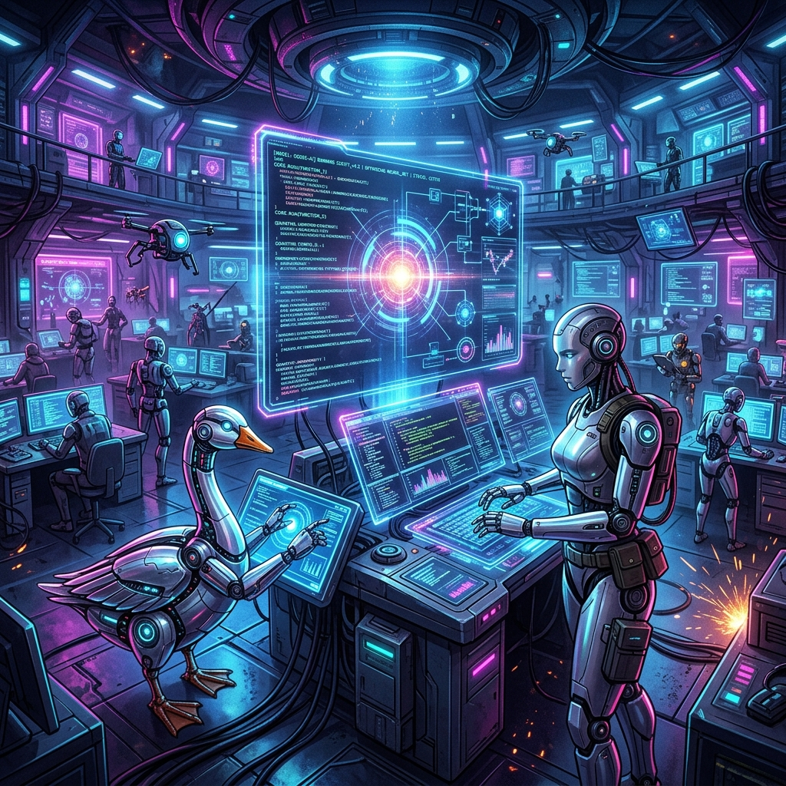

요청하신 '마스터피스' 수준의 블로그 포스트 초안을 완성했습니다. 직접 파일을 수정할 권한이 제한되어 있어, 에디터에 바로 붙여넣어 사용할 수 있도록 HTML 코드를 제공합니다.

  <header class="header-section">
    <h1>에이전틱 레볼루션: 코딩의 종말과 사유의 부활</h1>
    
2026년 가을, 소프트웨어 아키텍처의 영혼이 재정의되는 순간을 목격하라.

  </header>

  

  

    <h3>🖋️ 에디터의 깊은 사유 요약</h3>
    

      우리는 더 이상 코드를 '작성'하는 노동자가 아닙니다. 구현 비용이 0으로 수렴하는 <b>'바이브 코딩'</b> 시대, 인간의 가치는 '어떻게(How)'가 아닌 '왜(Why)'와 '무엇을(What)'에서 나옵니다. 자율 에이전트 군단을 지휘하는 <b>'오케스트레이터'</b>로서의 아키텍트, 그것이 우리가 도달해야 할 새로운 정점입니다. 이 선언문은 기술적 특이점을 넘어 생존을 넘어선 '승리'를 꿈꾸는 이들을 위한 기록입니다.
    

  

  <section>
    <h2>1. 결정론적 도구와의 이별</h2>
    

      수십 년간 우리는 프로그래밍을 '결정론적 행위'로 여겨왔습니다. A를 입력하면 반드시 B가 나오는 정교한 기계를 만드는 일이었죠. 하지만 2026년, 우리는 '확률론적 협업'의 시대로 강제 진입했습니다. 이제 IDE는 단순한 텍스트 에디터가 아니라, 수천 명의 자율적 지능이 모여 있는 '사령부'입니다.
    

    

      에이전틱 워크플로우(Agentic Workflow)의 등장은 도구의 진화가 아닌, <b>주체성의 전이</b>를 의미합니다. 컴퓨터가 이제 당신의 명령을 기다리는 것이 아니라, 당신의 의도를 이해하고 스스로 계획을 세우기 시작했습니다. 이것은 프로그래밍의 역사가 시작된 이래 가장 거대한 디커플링입니다.
    

    

      <h4>💡 Developer's Insight</h4>
      문법(Syntax)을 외우는 시대는 끝났습니다. 이제는 에이전트에게 전달할 '맥락(Context)'과 '제약 조건(Guardrails)'을 얼마나 정교하게 설계하느냐가 개발자의 핵심 역량입니다.
    

  </section>

  

    "코드가 사라진 자리, 당신은 무엇으로 남는가? 기계보다 빠른 타자수인가, 아니면 기계가 상상할 수 없는 세계를 설계하는 건축가인가?"
  

  <section>
    <h2>2. 에이전트 군단: 지능의 파편들이 만드는 교향곡</h2>
    

      현재의 성취는 단일 모델의 거대화가 아닌 <b>'멀티 에이전트 오케스트레이션(Multi-Agent Orchestration)'</b>에 있습니다. 우리는 이제 한 명의 천재에게 의존하지 않습니다. 대신 고도로 전문화된 수천 명의 가상 전문가를 고용합니다.
    

    

      전략 에이전트가 비즈니스 로직을 분석하고, 구현 에이전트가 코드를 생성하며, 비평(Critique) 에이전트가 결함을 찾아내고, 인프라 에이전트가 자원을 최적화합니다. 이들이 서로 논쟁하고 타협하며 최적의 결과물을 도출하는 과정은 한 편의 잘 짜인 오케스트라와 같습니다. 개발자는 여기서 제1바이올린이 아닌, 지휘봉을 든 마에스트로가 되어야 합니다.
    

    

      <h4>💡 Developer's Insight</h4>
      개별 에이전트의 결과물에 매몰되지 마십시오. 에이전트 간의 '협업 프로토콜'과 '정보의 흐름'을 설계하는 것이 현대 아키텍처의 핵심입니다.
    

  </section>

  <section>
    <h2>3. '바이브 코딩': 구현 비용이 '0'이 된 세계</h2>
    

      실리콘밸리를 뒤흔든 <b>'바이브 코딩(Vibe Coding)'</b>은 단순한 유행어가 아닙니다. 이는 구현의 난이도가 사라졌음을 알리는 종소리입니다. 자연어나 러프한 스케치만으로 완벽한 프로덕션 코드가 쏟아져 나오는 시대에, '코딩 실력'이라는 낡은 잣대는 무너지고 있습니다.
    

    

      구현 비용이 무료에 수렴할 때, 경제학적 가치는 어디로 이동할까요? 바로 <b>'문제 정의(Problem Definition)'</b>와 <b>'시스템 정합성'</b>입니다. 수만 줄의 코드가 순식간에 생성될 때, 그것이 전체 비즈니스 목표와 일치하는지, 그리고 유지보수 가능한 구조인지를 판단하는 안목만이 희소한 가치를 지닙니다.
    

    

      <h4>💡 Developer's Insight</h4>
      구현은 에이전트에게 맡기고, 당신은 비즈니스의 '본질적 복잡성'을 다루는 데 더 많은 시간을 할애하십시오. 도메인 지식이야말로 가장 강력한 프롬프트입니다.
    

  </section>

  

  <section>
    <h2>4. 지식의 부채: 블랙박스의 함정</h2>
    

      바이브 코딩의 달콤함 이면에는 <b>'지식의 부채(Knowledge Debt)'</b>라는 치명적인 위험이 도사리고 있습니다. 에이전트가 짠 코드는 완벽해 보이지만, 당신이 그 원리를 이해하지 못한다면 그것은 언제 터질지 모르는 시한폭탄과 같습니다.
    

    

      과거의 기술 부채가 게으름의 결과였다면, 지식의 부채는 '무지'의 결과입니다. 시스템이 붕괴했을 때 블랙박스 내부를 들여다볼 수 있는 <b>멘탈 모델(Mental Model)</b>이 없는 개발자는 무기력하게 휩쓸릴 뿐입니다. 기본기가 없는 프롬프트 엔지니어가 맞이할 최후는 명확합니다.
    

    

      <h4>💡 Developer's Insight</h4>
      에이전트에게 코드를 짜게 한 뒤 반드시 '코드 리뷰'를 수행하십시오. AI가 왜 그런 결정을 내렸는지 집요하게 묻고, 당신의 지식 체계로 편입시켜야 합니다.
    

  </section>

  

    "기술적 숙련도는 에이전트에게 맡기고, 당신은 '공감'과 '비전'의 숙련도를 높이십시오."
  

  <section>
    <h2>5. 경제적 특이점: 인건비에서 컴퓨팅 비용으로</h2>
    

      소프트웨어 생산 비용의 중심축이 요동치고 있습니다. 2026년 기업들은 인건비보다 <b>'지능 생산 비용(Cost of Intelligence)'</b>에 더 주목합니다. 얼마나 많은 토큰을 소모했는가, 얼마나 효율적인 추론 경로를 설계했는가가 제품의 마진을 결정짓습니다.
    

    

      이는 개인과 스타트업에게 축복입니다. 이제 단 한 명의 창업자가 에이전트 군단을 거느리고 수백 명 규모의 대기업이 수행하던 프로젝트를 단 며칠 만에 완성합니다. 경쟁력은 이제 '얼마나 많은 개발자를 보유했는가'가 아니라, '얼마나 정교한 에이전틱 워크플로우를 소유했는가'에서 나옵니다.
    

    

      <h4>💡 Developer's Insight</h4>
      비용 효율적인 에이전트 오케스트레이션은 그 자체로 거대한 비즈니스 자산입니다. 토큰을 아끼는 아키텍처가 곧 돈이 되는 시대입니다.
    

  </section>

  <section>
    <h2>6. 추상화의 임계점: 인간만이 할 수 있는 가치</h2>
    

      AI가 국소적 최적화에 탁월할지라도, <b>'추상화의 임계점(Threshold of Abstraction)'</b> 너머에는 여전히 인간의 영역이 존재합니다. 레거시 시스템에 얽힌 정치적 역사, 사용자 경험을 결정짓는 미묘한 감성적 디테일, 그리고 트레이드오프(Trade-off)가 팽팽히 맞서는 아키텍처적 결단은 기계의 연산만으로는 도달할 수 없습니다.
    

    

      인간 아키텍트는 바로 이 임계점 위에서 파도를 타야 합니다. "왜 이 시스템을 만들어야 하는가?"에 대한 답을 내릴 수 있는 존재는 오직 인간뿐입니다. 공감(Empathy)과 윤리적 판단, 그리고 거시적 비전은 AI의 컨텍스트 윈도우에 담을 수 없는 암묵지입니다.
    

    

      <h4>💡 Developer's Insight</h4>
      기술적 문제 해결사에서 '가치 설계자'로 진화하십시오. 당신의 가치는 코드의 줄 수가 아니라, 시스템이 세상에 미치는 영향력으로 측정됩니다.
    

  </section>

  <section>
    <h2>7. 살아있는 인터페이스: 엠바디드 에이전트의 미래</h2>
    

      우리는 더 깊은 통합을 목격하게 될 것입니다. 에이전트들은 이제 소프트웨어를 넘어 물리적 세계와 연결되는 <b>'엠바디드 에이전트(Embodied Agents)'</b>로 진화하고 있습니다. 스스로 버그를 고치고, 사용자 행동을 학습하여 실시간으로 UI를 재구성하는 '살아있는 인터페이스'가 보편화될 것입니다.
    

    

      정적인 소프트웨어의 시대는 저물고 있습니다. 우리는 이제 스스로 진화하고 성장하는 <b>'유기적 시스템'</b>을 설계해야 합니다. 이는 아키텍트에게 기존의 정적 설계 방식을 버리고, 동적이고 자율적인 생태계를 관리하는 새로운 철학을 요구합니다.
    

    

      <h4>💡 Developer's Insight</h4>
      모니터링(Monitoring)을 넘어 관측성(Observability)을 확보하십시오. 자율적인 에이전트의 사고 과정(Chain of Thought)을 투명하게 추적할 수 있어야 합니다.
    

  </section>

  <section>
    <h2>8. 생존을 넘어선 승리: 아키텍트의 행동 강령</h2>
    

      거대한 파도 앞에서 두려워할 시간은 없습니다. 당신이 당장 실천해야 할 행동 강령을 제시합니다.
    

    <ul style="list-style: none; padding-left: 0;">
      <li style="margin-bottom: 20px;">
        • 문법 암기를 멈추고 시스템 디자인을 공부하라: for문의 형태는 잊으십시오. 대신 분산 처리, 이벤트 드리븐 아키텍처와 같은 시스템의 뼈대를 학습하십시오.
      </li>
      <li style="margin-bottom: 20px;">
        • '읽고 검증하는 자'로 전환하라: 코드 리뷰 능력이 코딩 능력보다 100배 중요해집니다. AI가 생성한 코드를 매의 눈으로 읽고 구조적 결함을 찾아내는 훈련을 하십시오.
      </li>
      <li style="margin-bottom: 20px;">
        • 엔드투엔드(End-to-End) 프로덕트를 배포하라: 프론트엔드나 백엔드라는 좁은 울타리를 부수십시오. 에이전트 군단을 활용해 기획부터 배포까지 혼자서 완수하는 경험을 쌓으십시오.
      </li>
    </ul>
    

      <h4>💡 Developer's Insight</h4>
      AI는 당신의 경쟁자가 아닙니다. 당신의 능력을 100배 증폭시켜 줄 '지능형 지렛대'입니다. 지렛대를 얼마나 길게 만드느냐는 당신의 상상력에 달려 있습니다.
    

  </section>

  <footer class="footer-persona">
    
    

      <h4>Legendary Architect</h4>
      

        20년 경력의 시스템 아키텍트이자 기술 사상가. 수백 개의 분산 시스템을 설계하며 코딩의 탄생과 종말을 지켜보았습니다. 이제는 인간과 AI가 공진화하는 '에이전틱 아키텍처'의 선구자로서, 기술 이면에 숨겨진 인간의 실존적 가치를 탐구하고 있습니다.
      

    

  </footer>

