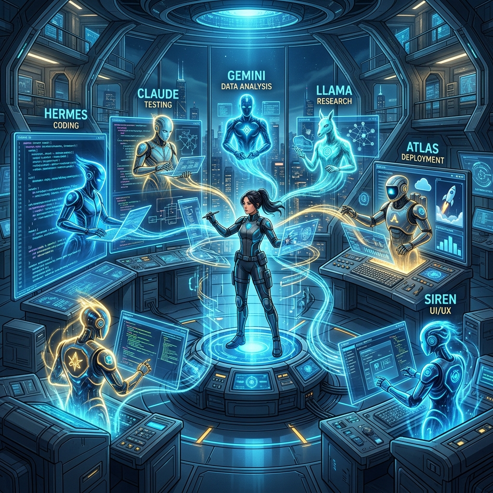
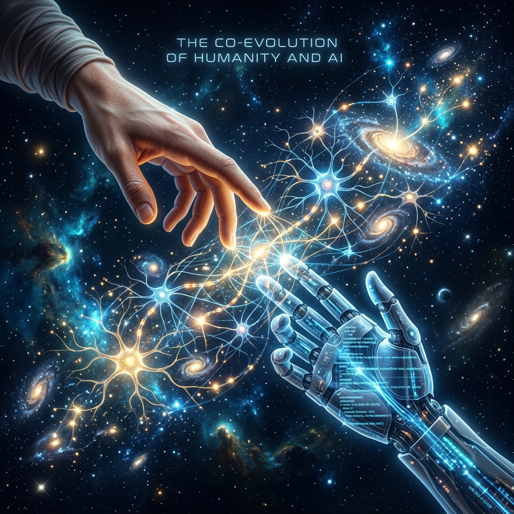

최신 2026년 5월 기술 트렌드(AI 에이전트 군단, 바이브 코딩, 지식의 부채 등)와 깊은 철학적 사유를 결합하여 작성되었습니다.

<!DOCTYPE html>
<html lang="ko">
<head>
    <meta charset="UTF-8">
    <meta name="viewport" content="width=device-width, initial-scale=1.0">
    <title>Agentic SW Development: The Great Decoupling</title>

</head>
<body>

  <!-- Header Section -->
  <header style="text-align: left; margin-bottom: 80px;">
    <h1>에이전틱 레볼루션: 코딩의 종말과 사유의 부활</h1>
    
2026년 가을, 소프트웨어 아키텍처의 영혼이 재정의되는 거대한 디커플링의 서막

    

  </header>

  

  <!-- Summary Box -->
  

    <h3 style="margin-top: 0; color: #2563eb; font-weight: 900; font-size: 1.5rem;">🖋️ 에디터의 깊은 사유 요약</h3>
    

      우리는 더 이상 코드를 '작성'하는 노동자가 아닙니다. 구현 비용이 0으로 수렴하는 <b>'바이브 코딩'</b> 시대, 인간의 가치는 '어떻게(How)'가 아닌 '왜(Why)'와 '무엇을(What)'에서 나옵니다. 자율 에이전트 군단을 지휘하는 <b>'오케스트레이터'</b>로서의 아키텍트, 그것이 우리가 도달해야 할 새로운 정점입니다. 코드가 사라진 빈자리, 당신은 기계보다 빠른 타자수가 아닌, 기계가 감히 상상할 수 없는 세계를 설계하는 건축가로 남아야 합니다.
    

  

  <!-- Body Section 1 -->
  <section>
    <h2>01. 결정론적 도구와의 이별</h2>
    

      수십 년간 우리는 프로그래밍을 '결정론적 행위'로 여겨왔습니다. 정해진 문법에 따라 코드를 입력하면 반드시 예상된 결과가 나오는 정교한 기계를 만드는 과정이었죠. 하지만 2026년 5월, 우리는 '확률론적 협업'의 시대로 강제 진입했습니다. 이제 IDE는 단순한 텍스트 에디터가 아니라, 수천 명의 자율적 지능이 상주하는 '지능형 사령부'입니다.
    

    

      에이전틱 워크플로우(Agentic Workflow)의 등장은 도구의 진화를 넘어 <b>'주체성의 전이'</b>를 의미합니다. 컴퓨터는 이제 당신의 명령을 수동적으로 기다리지 않습니다. 사용자의 모호한 요청 속에서 스스로 의도를 추출하고, 계획을 세우며, 실행 결과를 평가하여 최적의 경로를 재탐색합니다. 이것은 프로그래밍의 역사가 시작된 이래 가장 거대한 디커플링입니다.
    

    

      <h4 style="margin-top: 0; color: #0369a1; font-size: 1.2rem;">💡 Developer's Insight</h4>
      
문법(Syntax)을 암기하는 시대는 끝났습니다. 이제 개발자의 핵심 역량은 에이전트에게 전달할 <b>'맥락(Context)'</b>과 시스템의 안정성을 보장할 <b>'제약 조건(Guardrails)'</b>을 얼마나 정교하게 설계하느냐에 달려 있습니다.

    

  </section>

  <!-- Body Section 2 -->
  <section>
    <h2>02. 에이전트 군단: 지능의 파편들이 만드는 교향곡</h2>
    

      현재의 가장 눈부신 성취는 단일 모델의 거대화가 아닌 <b>'멀티 에이전트 오케스트레이션(Multi-Agent Orchestration)'</b>의 정교화에 있습니다. 우리는 이제 한 명의 천재에게 모든 것을 의존하지 않습니다. 대신 고도로 전문화된 수천 명의 가상 전문가, 즉 '에이전트 군단'을 고용합니다.
    

    

      비즈니스 로직을 분석하는 전략 에이전트, 최신 보안 컨벤션을 준수하며 코드를 생성하는 구현 에이전트, 그리고 구현된 코드의 잠재적 결함을 매의 눈으로 찾아내는 비평(Critique) 에이전트. 이들이 서로 논쟁하고 타협하며 최적의 결과물을 도출하는 과정은 한 편의 잘 짜인 오케스트라와 같습니다. 개발자의 역할은 여기서 제1바이올린을 켜는 것이 아니라, 지휘봉을 든 마에스트로가 되는 것입니다.
    

    

      <h4 style="margin-top: 0; color: #0369a1; font-size: 1.2rem;">💡 Developer's Insight</h4>
      
개별 에이전트의 파편화된 결과물에 매몰되지 마십시오. 에이전트 간의 <b>'협업 프로토콜'</b>과 <b>'정보의 흐름'</b>을 설계하는 능력이 현대 소프트웨어 아키텍처의 핵심 무기입니다.

    

  </section>

  

    "구현이 무료가 된 시대, 당신의 몸값은 당신이 타이핑하는 코드의 양이 아니라, 당신이 던지는 '질문의 크기'로 결정된다."
  

  <!-- Body Section 3 -->
  <section>
    <h2>03. '바이브 코딩': 구현 비용이 '0'이 된 세계</h2>
    

      최근 실리콘밸리를 뒤흔든 <b>'바이브 코딩(Vibe Coding)'</b>은 단순한 유행어가 아닙니다. 이는 구현의 난이도가 사실상 사라졌음을 알리는 종소리입니다. 자연어나 러프한 스케치만으로 완벽한 프로덕션 수준의 코드가 쏟아져 나오는 시대에, '코딩 실력'이라는 낡은 잣대는 무너지고 있습니다.
    

    

      구현 비용(Cost of Implementation)이 0으로 수렴할 때, 경제학적 가치는 어디로 이동할까요? 바로 <b>'문제 정의(Problem Definition)'</b>와 <b>'시스템 정합성'</b>입니다. 수만 줄의 코드가 순식간에 생성될 때, 그것이 전체 비즈니스 목표와 일치하는지, 그리고 유지보수 가능한 구조인지를 판단하는 안목만이 유일하게 희소한 가치를 지닙니다.
    

    

      <h4 style="margin-top: 0; color: #0369a1; font-size: 1.2rem;">💡 Developer's Insight</h4>
      
구현은 에이전트에게 맡기고, 당신은 비즈니스의 <b>'본질적 복잡성'</b>을 다루는 데 더 많은 시간을 할애하십시오. 도메인 지식이야말로 에이전트를 움직이는 가장 강력한 프롬프트입니다.

    

  </section>

  <!-- Body Section 4 -->
  <section>
    <h2>04. 지식의 부채: 블랙박스의 함정</h2>
    

      바이브 코딩의 달콤함 이면에는 <b>'지식의 부채(Knowledge Debt)'</b>라는 치명적인 독이 숨어 있습니다. 에이전트가 생성한 코드는 겉보기엔 완벽한 마천루 같지만, 당신이 그 내부 원리를 이해하지 못한다면 그것은 언제 터질지 모르는 시한폭탄과 같습니다.
    

    

      과거의 기술 부채가 바쁜 일정 탓에 타협한 결과였다면, 지식의 부채는 '무지'의 결과입니다. 시스템이 붕괴했을 때 블랙박스 내부를 들여다볼 수 있는 <b>멘탈 모델(Mental Model)</b>이 없는 개발자는 무기력하게 휩쓸릴 뿐입니다. 기본기 없는 프롬프트 엔지니어가 맞이할 최후는 명확합니다.
    

    

      <h4 style="margin-top: 0; color: #0369a1; font-size: 1.2rem;">💡 Developer's Insight</h4>
      
에이전트가 코드를 완성한 후 반드시 <b>'심층 리뷰'</b>를 수행하십시오. AI가 왜 그런 설계를 선택했는지 집요하게 묻고, 그 논리를 당신의 지식 체계로 편입시켜야 합니다.

    

  </section>

  <!-- Body Section 5 -->
  <section>
    <h2>05. 오케스트레이터: 생존의 축이 이동하다</h2>
    

      위기에서 살아남으려면 자신의 포지셔닝을 과감히 바꿔야 합니다. 코드를 타이핑하는 생산자에서, 복잡한 시스템과 여러 AI 에이전트들을 조율하는 <b>'오케스트레이터(Orchestrator)'</b>로 진화해야 합니다.
    

    

      오케스트레이터는 악기의 세부적인 연주법에 집착하지 않습니다. 전체 교향곡이 어떻게 흘러가는지, 시스템의 병목과 지연을 어떻게 설계할 것인지, 그리고 산출물이 비즈니스 가치와 정렬되어 있는지에 집중합니다. 이제 이력서의 기술 스택 리스트보다 '에이전틱 아키텍처 설계 경험'이 당신의 가치를 증명할 것입니다.
    

    

      <h4 style="margin-top: 0; color: #0369a1; font-size: 1.2rem;">💡 Developer's Insight</h4>
      
단일 에이전트와의 1:1 대화를 넘어, 여러 에이전트가 협업하는 <b>'워크플로우 엔진'</b>을 구축해 보십시오. 그것이 당신을 대체 불가능한 아키텍트로 만들 것입니다.

    

  </section>

  <!-- Body Section 6 -->
  <section>
    <h2>06. 추상화의 임계점: 인간만이 할 수 있는 가치</h2>
    

      AI는 국소적 최적화(Local Optimization)에 있어서는 이미 인간을 아득히 초월했습니다. 하지만 소프트웨어 공학에는 최신 AI 모델(GPT-5.5 등)조차 넘지 못한 <b>'추상화의 임계점(Threshold of Abstraction)'</b>이 존재합니다. 그 너머에는 기계가 연산할 수 없는 '인간만의 영토'가 있습니다.
    

    

      레거시 시스템에 얽힌 정치적 배경, 사용자 경험을 결정짓는 미묘한 감성적 디테일, 그리고 트레이드오프가 팽팽히 맞서는 아키텍처적 결단은 단순한 데이터 학습으로 도달할 수 없는 <b>'암묵지'</b>입니다. 인간 아키텍트는 바로 이 임계점 위에서 파도타기를 해야 합니다.
    

    

      <h4 style="margin-top: 0; color: #0369a1; font-size: 1.2rem;">💡 Developer's Insight</h4>
      
기술적 문제 해결사에서 <b>'가치 설계자'</b>로 진화하십시오. 당신의 가치는 코드의 줄 수가 아니라, 시스템이 사용자에게 전달하는 공감과 비전으로 측정됩니다.

    

  </section>

  

    "건축에서 반복적인 도면을 그리는 제도사가 사라졌다고 해서 건축가가 사라진 것은 아니다. 오히려 그들은 선 긋기에서 해방되어 더 원대한 마천루를 상상하게 되었다."
  

  <!-- Body Section 7 -->
  <section>
    <h2>07. 경제적 특이점: 지능 생산 비용의 시대</h2>
    

      소프트웨어 생산의 경제학이 요동치고 있습니다. 과거 소프트웨어 비용의 80%가 인건비였다면, 이제 기업들은 <b>'지능 생산 비용(Cost of Intelligence)'</b>이라는 새로운 지표에 주목합니다. 얼마나 많은 토큰을 효율적으로 소모했는가, 얼마나 최적화된 추론 경로를 설계했는가가 프로덕트의 마진을 결정짓습니다.
    

    

      이는 소규모 스타트업에게는 역사적인 축복입니다. 단 한 명의 창업자가 에이전트 군단을 거느리고 대기업 수준의 프로젝트를 며칠 만에 완성할 수 있게 되었기 때문입니다. 경쟁력은 이제 '누가 더 많은 개발자를 보유했는가'가 아니라, '누가 더 정교한 에이전틱 지능망을 소유했는가'에서 나옵니다.
    

    

      <h4 style="margin-top: 0; color: #0369a1; font-size: 1.2rem;">💡 Developer's Insight</h4>
      
비용 효율적인 에이전트 오케스트레이션은 그 자체로 강력한 비즈니스 자산입니다. <b>'토큰 경제학'</b>을 이해하고 관측성(Observability)을 확보하는 아키텍트가 시장을 지배할 것입니다.

    

  </section>

  <!-- Body Section 8 -->
  <section>
    <h2>08. 엠바디드 에이전트: 살아있는 인터페이스의 미래</h2>
    

      우리는 더 깊은 통합의 시대를 목격하고 있습니다. 에이전트들은 이제 단순히 텍스트와 코드를 주고받는 수준을 넘어, 물리적 세계와 소프트웨어를 잇는 <b>'엠바디드 에이전트(Embodied Agents)'</b>로 진화하고 있습니다. 스스로 버그를 감지하여 핫픽스를 배포하고, 사용자 행동 패턴을 학습하여 실시간으로 UI를 재구성하는 '살아있는 인터페이스'가 보편화될 것입니다.
    

    

      정적인 소프트웨어의 시대는 저물고 있습니다. 우리는 스스로 진화하고 성장하는 <b>'유기적 시스템'</b>을 설계해야 합니다. 이는 아키텍트에게 기존의 결정론적 설계 방식을 과감히 버리고, 동적이고 자율적인 생태계를 관리하는 새로운 철학적 사유를 요구합니다.
    

  </section>

  <!-- Footer Section -->
  <footer class="footer-persona">
    
    

      <h4>Legendary Architect</h4>
      

        20년 경력의 시스템 아키텍트이자 기술 사상가. 코딩의 탄생과 종말을 지켜본 관찰자로서, 이제는 인간과 AI가 공진화하는 '에이전틱 아키텍처'의 선구자로 활동하고 있습니다. 기술은 결코 인간을 대체하지 않습니다. 다만 준비된 인간에게 '군단'이라는 날개를 달아줄 뿐입니다.
      

    

  </footer>

</body>
</html>